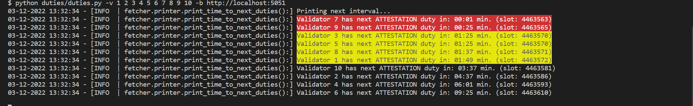
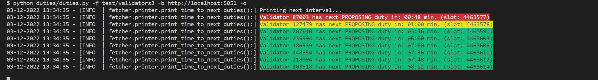
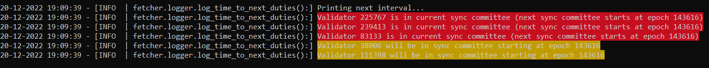

<!-- markdownlint-disable MD033 -->

# eth-duties

ETH-duties logs upcoming validator duties to the console in order to find the best maintenance period for your validator(s). In general the tool was developed to mainly help home stakers but it still can be used on a larger scale (see [usage](#usage) examples).

## Table of Contents

* [Caveat](#caveat)
* [What to expect](#what-to-expect)
  * [Examples](#examples)
* [Compatibility](#compatibility)
* [Usage](#usage)
* [Contribute](#contribute)
  * [Requirements](#requirements)
  * [Installation](#installation)
* [Build on your own](#build-on-your-own)
* [Run in Docker](#run-in-docker)
* [ToDos](#todos)

## Caveat

1. I only tested the tool with the following beaon clients:

    * lighthouse
    * teku

    However, since it only calls official ETH2 spec endpoints it should work with every client. As a side node, I had issues with `Teku 22.10.1` as the tool crashed from time to time. I read in the teku release notes that they updated their REST API framework in version `22.10.2` and since then I did not experience any issues.

1. The maximum number of validators (validator indices) which can be provided by the user is currently at 300. The reason for that is a simple one and will be fixed in a future release.

## What to expect

Beside the actual functionality of logging upcoming duties I added some kind of UX in form of color coding.

The color coding comprises of:

| Color | Description |
| --- | --- |
| GREEN | Indicates upcoming block proposer duties |
| YELLOW | The upcoming duty will be performed in less than 2 minutes **or** your validator was chosen to be part in the next sync committee |
| RED | The upcoming duty will be performed in less than 1 minute **or** your validator is part of the current sync committee |

### Examples

1. Attestion duties for some validators 
1. Block proposing duties for some validators 
1. Sync committee duties for some validators 

## Compatibility

**Note: The linux binary will only work on Ubuntu 22.04. That's due to the fact how pyinstaller bundles everything together for a specific OS. Since Ubuntu 20.04 is probably still widely in usage I will add another pipeline to build the binary specifically for Ubuntu 20.04. I will also rename the final artifact for better clarity.**

| OS | Tested | Works |
| --- | --- | --- |
| MacOS 11 | True | True |
| MacOS 12 | True | True |
| Ubuntu 20.04 | True | False |
| Ubuntu 22.04 | True | True |
| Windows 7 | False | - |
| Windows 10 | True | True |
| Windows 11 | False | - |

I would love to get feedback from the community, especially for the missing OS I couldn't test.

## Usage

Just download the artifact for your OS and start optimizing your validator maintenance periods. The example commands are based on calls on the linux binary (don't forget to make it executable).

1. Print the help:

    ```bash
    ./eth-duties --help
    ```

1. Print upcoming duties for two validators while connecting to a local beacon client:

    ```bash
    ./eth-duties \
    --validators <VALIDATOR_INDEX_1> <VALIDATOR_INDEX_2> \
    --beacon-node http://localhost:5052
    ```

1. Print upcoming duties for multiple validators using different identifiers while connecting to a local beacon client:

    ```bash
    # You can mix up indices and pubkeys as you like
    # You can add the flag '--validators' multiple times
    ./eth-duties \
    --validators <VALIDATOR_INDEX_1> <VALIDATOR_INDEX_2> \
    --validators <VALIDATOR_PUBKEY_3> <VALIDATOR_INDEX_4> \
    --beacon-node http://localhost:5052
    ```

1. Print upcoming duties for multiple validators using an alias for some of the provided validators while connecting to a local beacon client:

    ```bash
    # If you want to set an alias for a validator pubkey or index you need to separate the index/pubkey from the alias with an ';'
    # Furthermore you need to put the expression in quotes or double quotes 
    ./eth-duties \
    --validators "<VALIDATOR_INDEX_1>;VALIDATOR_1" <VALIDATOR_INDEX_2> \
    --validators "<VALIDATOR_PUBKEY_3>;VALIDATOR_3" <VALIDATOR_INDEX_4> \
    --beacon-node http://localhost:5052
    ```

1. Print upcoming duties for validators which indices/pubkeys are located in a file:

    ```bash
    # Mixing indices and pubkeys and/or adding aliases is also supported in files
    # Note that you do not need to put '<INDEX_OR_PUBKEY>;<ALIAS>' in quotes or double quotes in your validator file
    ./eth-duties \
    --validator-file <PATH_TO_VALIDATOR_FILE> \
    --beacon-node http://localhost:5052
    ```

1. Print upcoming validator duties but omit attestation duties specifically. This can be useful for professional node operators or individuals with a lot of validators as printing upcoming attestation duties for a lot of validators might get messy and you want to concentrate on the important stuff:

    ```bash
    ./eth-duties \
    --validator-file <PATH_TO_VALIDATOR_FILE> \
    --beacon-node http://localhost:5052 \
    --omit-attestation-duties
    ```

## Contribute

If you want to contribute you need to setup the project which is described in this section.

### Requirements

* `Python 3.10`

The tool explicitly needs `Python 3.10` as I use a feature which was just introduced with this version.

`Python 3.11` will not work currently as the dependencies weren't updated for that version yet.

In general it is recommended to work with virtual environments instead of a global python installation. This is out of scope of this documentation.

### Installation

Dependencies are organized and managed using poetry. Poetry itself needs `Python 3.7` or later.

My personal workflow to manage virtual environments is to use [miniconda/Anaconda](https://docs.conda.io/en/latest/miniconda.html), therefore the steps described are based on this toolchain.

1. Navigate to the root folder of the repository
1. Create new conda environment with poetry

    ```bash
    conda env create -f poetry_env.yaml
    ```

1. Activate your newly created conda environment

    ```bash
    conda activate poetry-py310
    ```

1. List your Python environments with poetry

    ```bash
    poetry env info
    # You will receive a Python System and Virtualenv output
    ```

1. Create a separate poetry virtual env

    ```bash
    # Create a poetry virtual env while using the executable/binary path of the virtualenv output of the command before
    poetry env use <PATH_TO_PYTHON_EXECUTABLE_OF_VIRTUALENV>
    ```

1. Install dependencies

    ```bash
    # Installs all dependencies
    poetry install

    # Installs only dependencies for running the application
    poetry install --only main
    ```

## Build on your own

You can build the binary/executable on your own. This will work out of the box if you installed all dev dependencies (see [installation](#installation)).

Note: Pyinstaller uses the OS where it runs on to build the respective artefact. So if you are on a windows machine you will build an executable of eth-duties.

As always you need to navigate to the root folder of this repository first. Make sure you are in the correct virtual environment where you installed the dependencies.

1. Build Windows executable

    ```cmd
    poetry run pyinstaller --clean --onefile --add-data config;config --name eth-duties .\duties\main.py
    ```

1. Build Linux or MacOS binary

    ```bash
    poetry run pyinstaller --clean --onefile --add-data config:config --name eth-duties ./duties/main.py
    ```

## Docker

### Run in Docker

1. Build image

    ```bash
    docker build -t tobiwo/eth-duties:latest -f docker/dockerfile .
    ```

1. Run container

    ```bash
    docker run \
    --rm \
    --name eth-duties \
    tobiwo/eth-duties:latest \
    --validators 123456 456789 \
    --validators 0x98... \
    --beacon-node http://locahost:5052
    ```

1. Run container on boot

    ```bash
    docker run \
    -d \
    --restart always \
    --name eth-duties \
    tobiwo/eth-duties:latest \
    --validators 123456 456789 \
    --beacon-node http://locahost:5052
    ```

1. Print logs

    ```bash
    docker logs eth-duties --tail=20 -f
    ```

### Docker compose

You can find a template `compose.yaml` in the `docker` folder of this repository. Please replace all placeholders with actual values before using it. If you do not copy the compose to your own setup the commands for starting the container would be (from the root of this repo):

```bash
# Using compose plugin for docker
docker compose -f docker/compose.yaml up -d

# Using docker-compose binary
docker-compose -f docker/compose.yaml up -d
```

## ToDos

* add validation of beacon client url
* add support for more than 300 validators (split provided validators to chunks for api calls)
* add some explainer at program start for color coding
* improve fetching in case no duties could be detected
  * only fetch if new epoch started
* implement asyncio to improve UX and optimize fetching logic
* test with nimbus and lodestar
