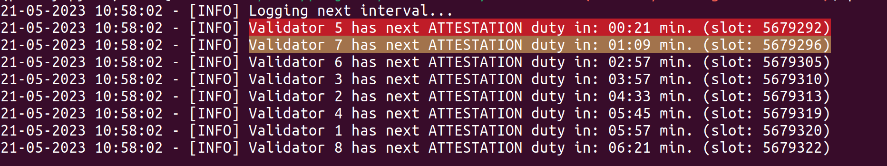
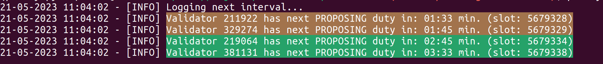
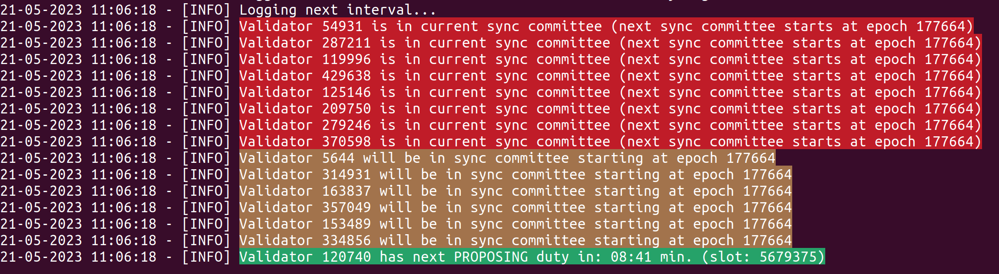

<!-- markdownlint-disable MD033 -->

# eth-duties


ETH-duties logs upcoming validator duties to the console in order to find the best maintenance period for your validator(s). In general the tool was developed to mainly help home stakers but it still can be used on a larger scale (see [usage](#usage) examples).

**Note on docker `latest` tag: Currently the docker image tag `latest` refers to the latest changes on the `main` branch. Please be aware of that if you decide to use this tag.**

## Table of Contents

* [Consensus client compatibility](#consensus-client-compatibility)
* [Configuration](#configuration)
  * [--mode](#mode)
    * [What are relevant duties](#what-are-relevant-duties)
    * [cicd-exit](#cicd-exit)
    * [cicd-wait](#cicd-wait)
    * [cicd-force-graceful-exit](#cicd-force-graceful-exit)
  * [--mode-cicd-attestation-time and --mode-cicd-attestation-proportion](#mode-cicd-attestation-time-and-mode-cicd-attestation-proportion)
  * [--validators](#validators)
* [What to expect](#what-to-expect)
  * [Examples](#examples)
* [Binary/Executable Compatibility](#binary-executable-compatibility)
* [Usage](#usage)
* [Contribute](#contribute)
  * [Requirements](#requirements)
  * [Installation](#installation)
* [Build on your own](#build-on-your-own)
* [Docker](#docker)
  * [Run in Docker](#run-in-docker)
  * [Docker compose](#docker-compose)
* [Donate](#donate)
  * [Full disclosure](#full-disclosure)

## Consensus client compatibility

| client | tested | compatible |
|  --- |  --- | --- |
| prysm | :heavy_check_mark: | :heavy_check_mark: |
| lighthouse | :heavy_check_mark: | :heavy_check_mark: |
| teku | :heavy_check_mark: | :heavy_check_mark: |
| nimbus | :heavy_check_mark: | :heavy_check_mark: |
| lodestar | :heavy_check_mark: | :heavy_check_mark: |

## Configuration

Most of the available flags are self explanatory. However, some may not be that obvious. Those flags are described in detail in the following chapter.

For all available cli flags please call `eth-duties --help` (see usage examples for further details).

### mode

The default running mode of `eth-duties` is logging duties to the console (specified with value `log`). However, professional node operators or advanced home stakers might leverage the tool in their cicd pipelines to e.g. prevent an unintentional client update when your validator is right before proposing a block or part of the sync committee. This is where the different `cicd` modes come into play. You can make your deployment job dependent from the `eth-duties` job so that the deployment job will only run when `eth-duties` exits gracefully with `exit code 0`. This documentation will not go into detail about advanced pipelines in gitlab or github. However, I will provide a separate `cicd-compose.yaml` (in docker folder) which may be adopted by home stakers.

**Note** If you do not omit attestation duties with `--omit-attestation-duties` these are also considered as valid duties for the cicd modes. For a more fine granular setting on attestation duties please check the [chapter about --mode-cicd-attestation-time and --mode-cicd-attestation-proportion](#mode-cicd-attestation-time-and-mode-cicd-attestation-proportion)

#### What are relevant duties

In the following sub chapters I will often refer to relevant duties. This is a short explanation. Relevant are:

* validator is in current sync committee
* validator is in next sync committee
* validator will propose a block
* x of y attestation duties (while y == number of validators monitored) need to be executed in less than a defined time threshold
  * see [chapter about --mode-cicd-attestation-time and --mode-cicd-attestation-proportion](#mode-cicd-attestation-time-and-mode-cicd-attestation-proportion)

#### cicd-exit

This mode results in a one time check whether one of your supplied validators has an relevant upcoming duty. If there is one the tool exits with `exit code 1`. If there is none the tool exits with `exit code 0`.

#### cicd-wait

This mode results in an ongoing process (similar to the standard behavior) where `eth-duties` checks for relevant upcoming duties until there is none. If there will be no relevant upcoming duty the application exits with `exit code 0`. Compared to the standard logging behavior this process only runs for a certain amount of time (specified with flag `--mode-cicd-waiting-time` (default: 780 seconds, approx. 2 epochs)). If this timeframe ends, `eth-duties` exits with `exit code 1`.

#### cicd-force-graceful-exit

This mode results in an immediate graceful exit with `exit code 0` without checking for duties. The rationale behind this flag is the following: If your deployment job will not run because of upcoming duties but you need to force an update for whatever reason you can use the mode `cicd-force-graceful-exit`. I'm not an expert in github pipelines but in gitlab you can prefill environment variables when you start a pipeline manually via the web ui. This way you don't need to adapt your pipeline code but just restart a pipeline with the `cicd-force-graceful-exit` mode. In general how to setup your pipelines is out of scope of this documentation. For more information please check the respective platform documentation. For gitlab this would be [the following website](https://docs.gitlab.com/ee/ci/pipelines/index.html#prefill-variables-in-manual-pipelines).

### mode-cicd-attestation-time and mode-cicd-attestation-proportion

These flags can be specifically useful for home stakers with a small amount of validators while using any cicd mode (`cicd-exit` or `cicd-wait`). The idea is that a home staker with a small amount of validators most often handles attestation duties and it might be hard to figure out manually when to perform e.g. a client update so that you only miss the minimum amount of attestation duty rewards or even none. **It is important to note that upcoming sync-committee or block proposal duties are considered relevant in any way. This means `eth-duties` will always exits non-gracefully in mode `cicd-exit` and `cicd-wait` (when waiting threshold is reached) while one of these relevant duties is in the queue. In other words if your settings for monitoring attesation duties are matched it will get ignored when another relevant duty is in the queue.**

In general both flags refer to the fact that `eth-duties` will exit gracefully when the defined proportion of attestion duties will be executed after the provided time threshold. Let's check an example to get a better understanding. We assume a home staker who runs 10 validators:

* You want to exit `eth-duties` gracefully when 8/10 validator attestation duties need to be executed in 4 minutes or later:

  ```bash
  --mode cicd-wait --mode-cicd-attestation-time 240 --mode-cicd-attestation-proportion 0.8
  ```

For more clarity please check the `attestation-compose.yaml` within the docker folder.

These new flags will be only useful until a certain threshold of monitored validators is reached. This is because the higher the number of validators monitored the smaller the probability that a defined proportion of validator attestation duties will happen at a specified time in the future or later. To be more precise let's consider you monitor 30 validators. If you set the new flags to `--mode-cicd-attestation-time 240 --mode-cicd-attestation-proportion 0.8` it might never happen that 80% of attestation duties need to be performed in 4 minutes or later. You could reduce the proportion or/and time value but at some point these will not bring any value for you. You need to test a little bit what could be a good setting for your setup.

### validators

This flag is self-explanatory in general but you need to respect the following separation rules:

* Validator identifiers can be separated by comma or space e.g.:
  * `--validators 123 456 --validators 678 999`
  * `--validators 123,456 --validators 678,999`
* If you provide a validator identifier with an alias you need to wrap the whole string of one identifier-alias-pair in quotes or double quotes e.g.:
  * `--validators "123;val1" "456;val2" --validators 678 999` or
  * `--validators "123;val1","456;val2" --validators 678,999`

**Note: Wrapping an identifier-alias-pair in quotes or double quotes is not true for a `docker-compose`. Please check the example [compose](docker/compose.yaml).**

### rest

Eth-duties offers the possibility to start a rest server with some basic endpoints. This is a very simple implemenation which starts a rest server on your localhost. The server can be started with flag `--rest`. The port can be modified with `--rest-port`. The full swagger spec can be accessed (using default port 5000) via [http://localhost:5000/docs](http://localhost:5000/docs).

This functionality can be used to e.g. create own automation scripts for updating your Ethereum clients. Beside that it is now also possible to add and remove validator indices via rest calls.

## What to expect

Beside the actual functionality of logging upcoming duties I added some kind of UX in form of color coding.

The color coding comprises of:

| Color | Description |
| --- | --- |
| GREEN | Indicates upcoming block proposer duties |
| YELLOW | The upcoming duty will be performed in less than 2 minutes **or** your validator was chosen to be part in the next sync committee |
| RED | The upcoming duty will be performed in less than 1 minute **or** your validator is part of the current sync committee |

### Examples

1. Attestion duties for some validators 
1. Block proposing duties for some validators 
1. Sync committee duties for some validators 

## Binary (executable) Compatibility

**Note: The linux binary will only work on Ubuntu 22.04. That's due to the fact how pyinstaller bundles everything together for a specific OS. Since Ubuntu 20.04 is probably still widely in usage I will add another pipeline to build the binary specifically for Ubuntu 20.04. I will also rename the final artifact for better clarity.**

| OS | Tested | Works |
| --- | --- | --- |
| MacOS 11 | True | True |
| MacOS 12 | True | True |
| Ubuntu 20.04 | True | False |
| Ubuntu 22.04 | True | True |
| Windows 7 | False | - |
| Windows 10 | True | True |
| Windows 11 | False | - |

I would love to get feedback from the community, especially for the missing OS I couldn't test.

## Usage

Just download the artifact for your OS and start optimizing your validator maintenance periods. The example commands are based on calls on the linux binary (don't forget to make it executable).

1. Print the help:

    ```bash
    ./eth-duties --help
    ```

1. Print upcoming duties for two validators while connecting to a local beacon client:

    ```bash
    ./eth-duties \
    --validators <VALIDATOR_INDEX_1> <VALIDATOR_INDEX_2> \
    --beacon-node http://localhost:5052
    ```

1. Print upcoming duties for multiple validators using different identifiers while connecting to a local beacon client:

    ```bash
    # You can mix up indices and pubkeys as you like
    # You can add the flag '--validators' multiple times
    ./eth-duties \
    --validators <VALIDATOR_INDEX_1> <VALIDATOR_INDEX_2> \
    --validators <VALIDATOR_PUBKEY_3> <VALIDATOR_INDEX_4> \
    --beacon-node http://localhost:5052
    ```

1. Print upcoming duties for multiple validators using an alias for some of the provided validators while connecting to a local beacon client:

    ```bash
    # If you want to set an alias for a validator pubkey or index you need to separate the index/pubkey from the alias with an ';'
    # Furthermore you need to put the expression in quotes or double quotes 
    ./eth-duties \
    --validators "<VALIDATOR_INDEX_1>;VALIDATOR_1" <VALIDATOR_INDEX_2> \
    --validators "<VALIDATOR_PUBKEY_3>;VALIDATOR_3" <VALIDATOR_INDEX_4> \
    --beacon-node http://localhost:5052
    ```

1. Print upcoming duties for validators which indices/pubkeys are located in a file:

    ```bash
    # Mixing indices and pubkeys and/or adding aliases is also supported in files
    # Note that you do not need to put '<INDEX_OR_PUBKEY>;<ALIAS>' in quotes or double quotes in your validators file
    ./eth-duties \
    --validators-file <PATH_TO_VALIDATOR_FILE> \
    --beacon-node http://localhost:5052
    ```

1. Print upcoming validator duties but omit attestation duties:

    ```bash
    # Note: If you provide more than 50 validators, attestation related logs are omitted by default
    # This can be changed with '--max-attestation-duty-logs'
    ./eth-duties \
    --validators-file <PATH_TO_VALIDATOR_FILE> \
    --beacon-node http://localhost:5052 \
    --omit-attestation-duties
    ```

## Contribute

If you want to contribute you need to setup the project which is described in this section.

### Requirements

* `Python 3.10`

The tool explicitly needs `Python 3.10` as I use a feature which was just introduced with this version.

`Python 3.11` will not work currently as the dependencies weren't updated for that version yet.

In general it is recommended to work with virtual environments instead of a global python installation. This is out of scope of this documentation.

### Installation

Dependencies are organized and managed using poetry. Poetry itself needs `Python 3.7` or later.

My personal workflow to manage virtual environments is to use [miniconda/Anaconda](https://docs.conda.io/en/latest/miniconda.html), therefore the steps described are based on this toolchain.

1. Navigate to the root folder of the repository
1. Create new conda environment with poetry

    ```bash
    conda env create -f poetry_env.yaml
    ```

1. Activate your newly created conda environment

    ```bash
    conda activate poetry-py310
    ```

1. List your Python environments with poetry

    ```bash
    poetry env info
    # You will receive a Python System and Virtualenv output
    ```

1. Create a separate poetry virtual env

    ```bash
    # Create a poetry virtual env while using the executable/binary path of the virtualenv output of the command before
    poetry env use <PATH_TO_PYTHON_EXECUTABLE_OF_VIRTUALENV>
    ```

1. Install dependencies

    ```bash
    # Installs all dependencies
    poetry install

    # Installs only dependencies for running the application
    poetry install --only main
    ```

## Build on your own

You can build the binary/executable on your own. This will work out of the box if you installed all dev dependencies (see [installation](#installation)).

Note: Pyinstaller uses the OS where it runs on to build the respective artefact. So if you are on a windows machine you will build an executable of eth-duties.

As always you need to navigate to the root folder of this repository first. Make sure you are in the correct virtual environment where you installed the dependencies.

1. Build Windows executable

    ```cmd
    poetry run pyinstaller --clean --onefile --add-data config;config --name eth-duties .\duties\main.py
    ```

1. Build Linux or MacOS binary

    ```bash
    poetry run pyinstaller --clean --onefile --add-data config:config --name eth-duties ./duties/main.py
    ```

## Docker

### Run in Docker

**Note: You might have realized the `--tty` option for the `docker run` command. During development of the rest feature I realized that there is an issue with the server package I'm using to run the rest server and the colorful logging which eth-duties offers. Without adding the `tty` flag the logging wouldn't be colored for some reason. I will furhter investigate and hopefully find a more consistent solution in the future but for now please add the `tty` flag if you want colorful logging. The compose files where updated as well.**

1. Build image

    ```bash
    docker build -t tobiwo/eth-duties:latest -f docker/dockerfile .
    ```

1. Run container using space separation for --validators

    ```bash
    docker run \
    --tty \
    --rm \
    --name eth-duties \
    tobiwo/eth-duties:latest \
    --validators 123456 456789 \
    --validators 0x98... \
    --validators "111;My_Validator" "222;Validator2" \
    --beacon-node http://localhost:5052
    ```

1. Run container on boot using comma separation for --validators

    ```bash
    docker run \
    -d \
    --tty \
    --restart always \
    --name eth-duties \
    tobiwo/eth-duties:latest \
    --validators 123456,456789 \
    --validators "111;My_Validator","222;Validator2" \
    --beacon-node http://localhost:5052
    ```

1. Print logs

    ```bash
    docker logs eth-duties --tail=20 -f
    ```

### Docker compose

You can find a template `compose.yaml` in the `docker` folder of this repository. Please replace all placeholders with actual values before using it. If you do not copy the compose to your own setup the commands for starting the container would be (from the root of this repo):

```bash
# Using compose plugin for docker
docker compose -f docker/compose.yaml up -d

# Using docker-compose binary
docker-compose -f docker/compose.yaml up -d
```

## Donate

If you like the tool and think this needs to be supported I highly appreciate any donations. Donations can be send in ETH, any ERC-20 or on Layer2 to the following address: `0x89a6EeC1FAbC802741475259cBdeAC7d45FAc14a`.

### Full disclosure

This project will be funded by the Ethereum Foundation with a small grant from the [ecosystem support program](https://esp.ethereum.foundation/applicants/small-grants=).
