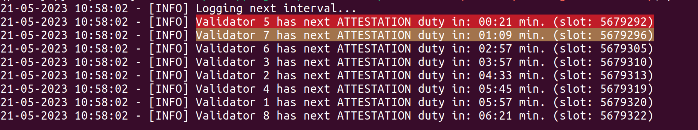
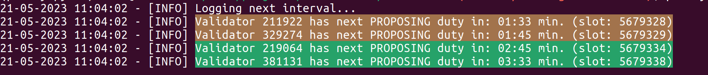
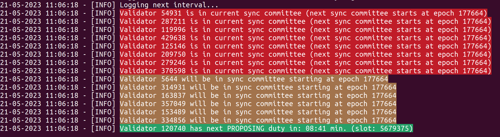

# eth-duties

ETH-duties logs upcoming validator duties to the console in order to find the best maintenance period for your validator(s). In general the tool was developed to mainly help home stakers but it still can be used on a larger scale (see usage examples for the [binary](./usage/binary.md) and [docker](./usage/docker.md)).

**Note on docker `latest` tag: Currently the docker image tag `latest` refers to the latest changes on the `main` branch. Please be aware of that if you decide to use this tag.**

## Consensus client compatibility

| client | tested | compatible |
|  --- |  --- | --- |
| prysm | :white_check_mark: | :white_check_mark: |
| lighthouse | :white_check_mark: | :white_check_mark: |
| teku | :white_check_mark: | :white_check_mark: |
| nimbus | :white_check_mark: | :white_check_mark: |
| lodestar | :white_check_mark: | :white_check_mark: |
| grandine | :white_check_mark: | :white_check_mark: |

### Caveat

#### Lodestar

If you're using Lodestar as a beacon client and need to track hundreds of validators, you may encounter an issue when providing validator identifiers as public keys. While I don't have the exact threshold, sending around 200 validator public keys to Lodestar's beacon API endpoints can overwhelm the system. However, using validator indices does not cause this problem.

It's important to note that when you use the `--validator-nodes` option, eth-duties will only utilize public keys internally, which can lead to the issue mentioned above. If you see many public keys in the error log with the message: "The following provided validators are not active and therefore will be skipped for further processing," this could indicate the problem discussed.

## What to expect

Beside the actual functionality of logging upcoming duties I added some kind of UX in form of color coding.

The color coding comprises of:

| Color | Description |
| --- | --- |
| GREEN | Indicates upcoming block proposer duties |
| YELLOW | The upcoming duty will be performed in less than a defined timeframe (default 2 minutes) **or** your validator was chosen to be part in the next sync committee |
| RED | The upcoming duty will be performed in less than a defined timeframe (default 1 minute) **or** your validator is part of the current sync committee |

### Examples

1. Attestion duties for some validators 
1. Block proposing duties for some validators 
1. Sync committee duties for some validators 

## Donate

If you like the tool and think this needs to be supported I highly appreciate any donations. Donations can be send in ETH, any ERC-20 or on Layer2 to the following address: `0x89a6EeC1FAbC802741475259cBdeAC7d45FAc14a`.

### Full disclosure

This project is funded by the Ethereum Foundation with a small grant from the [ecosystem support program](https://esp.ethereum.foundation/applicants/small-grants=).
